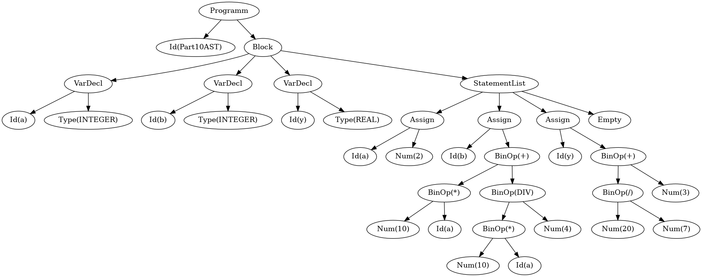

## C++ Version of https://ruslanspivak.com/lsbasi-part1/

### Chapter 1:
```sh
emiliano chapter01  $ g++ interpreter.cpp
emiliano chapter01 $ ./a.out 
calc> 1+1
2
calc> ^C
```
### Chapter 2:
```sh
emiliano chapter02  $ g++ interpreter.cpp
emiliano chapter02  $ ./a.out 
calc> 3-1
2
calc> ^C
```
### Chapter 3:
```sh
emiliano chapter03  $ g++ interpreter.cpp
emiliano chapter03 $ ./a.out 
calc> 1+2+3-1
5
calc> ^C
```
### Chapter 4:
```sh
emiliano chapter04  $ g++ interpreter.cpp
emiliano chapter04  $ ./a.out 
calc> 1*2*3/2
3
calc> ^C
```
### Chapter 5:
```sh
emiliano chapter05  $ g++ interpreter.cpp
emiliano chapter05  $ ./a.out 
calc> 10*10/2+10-60
0
calc> ^C
```
### Chapter 6:
```sh
emiliano chapter06  $ g++ interpreter.cpp
emiliano chapter06 $ ./a.out 
calc> 1+1*2
3
calc> 1+(1*2)
3
calc> (1+1)*2
4
calc> (1+3)/2+3*(1-1)
2
calc> (((1)))
1
calc> ^C
```

### Chapter 7:
```sh
emiliano chapter07 $ g++ main.cpp 
emiliano chapter07 $ ./a.out 
ctrl+c to exit
calc> (1+3)/2+3*(1-1)
RPN Notation -> 1 3+ 2/ 3 1 1-*+
Lisp Style - > (+(/(+1 3) 2) (*3 (-1 1)))
Abstract Syntax Tree
BinOp(+)
  BinOp(/)
    BinOp(+)
      Num(1)
      Num(3)
    Num(2)
  BinOp(*)
    Num(3)
    BinOp(-)
      Num(1)
      Num(1)

Result -> 2
ctrl+c to exit
calc> ^C
```

### Chapter 8:
```sh
emiliano chapter08 $ g++ main.cpp 
emiliano chapter08 $ ./a.out 
ctrl+c to exit
calc> 1*(-1)
Abstract Syntax Tree
BinOp(*)
  Num(1)
  UnaryOp(-)
  Num(1)

Result -> -1
ctrl+c to exit
calc> 1*-1
Abstract Syntax Tree
BinOp(*)
  Num(1)
  UnaryOp(-)
  Num(1)

Result -> -1
ctrl+c to exit
calc> ---1
Abstract Syntax Tree
UnaryOp(-)
UnaryOp(-)
UnaryOp(-)
Num(1)

Result -> -1
ctrl+c to exit
calc> --1
Abstract Syntax Tree
UnaryOp(-)
UnaryOp(-)
Num(1)

Result -> 1
ctrl+c to exit
calc> ^C
```
### Chapter 9-1:
```sh
emiliano chapter09-01  $ g++ main.cpp 
emiliano chapter09-01 $ ./a.out 
calc> a:=1+(2*(1+1))
Assignment()
  Id(a)
  BinOp(+)
    Num(1)
    BinOp(*)
      Num(2)
      BinOp(+)
        Num(1)
        Num(1)

5
calc> a:=1+b
Assignment()
  Id(a)
  BinOp(+)
    Num(1)
    Id(b)

Invalid Variable
calc> ^C
```
### Chapter 9-2:
```sh
emiliano chapter09-02 $ g++ main.cpp 
emiliano chapter09-02 $ cat test/test_ok.pas 
a:=1;
b:=2;
b:=b+a;
c:=a+b;
d:=c*2;
emiliano chapter09-02 $ ./a.out < test/test_ok.pas 
{a => 1,b => 3,c => 4,d => 8}
emiliano chapter09-02 $ cat test/test_fail.pas 
a:=1;
b:=2;
c:=a+b;
d:=f*2;
emiliano chapter09-02 $ ./a.out < test/test_fail.pas 
Undefined variable => f
```
### Chapter 9-3:
```sh
emiliano chapter09-03 $ c++ main.cpp 
emiliano chapter09-03 $ cat test/test_ok.pas 
BEGIN
  BEGIN
    number := 2;
    a := number;
    b := 10 * a + 10 * number / 4;
    c := a - - b
  END;
  x := 11;
END.
emiliano chapter09-03 $ ./a.out < test/test_ok.pas 
{a => 2,b => 25,c => 27,number => 2,x => 11}
emiliano chapter09-03 $ cat test/test_fail.pas 
BEGIN
  a:=1;
  b:=2;
  c:=a+b;
  d:=f*2;
END.
emiliano chapter09-03 $ ./a.out < test/test_fail.pas 
Undefined variable => f
```
### Chapter 10:
```pascal
PROGRAM Part11AST;
VAR
  a, b : INTEGER;
  y    : REAL;

BEGIN {Part11AST}
  a := 2;
  b := 10 * a + 10 * a DIV 4;
  y := 20 / 7 + 3.14;
END.  {Part11AST}
```
```sh
emiliano chapter10 $ c++ main.cpp 
emiliano chapter10 $ ./a.out < test/test_ok.pas 
Program(
  Id(Part10AST)
  Block(
    VarDecl(
      Id(a)
      Type(INTEGER)
    )
    VarDecl(
      Id(b)
      Type(INTEGER)
    )
    VarDecl(
      Id(y)
      Type(REAL)
    )
    StatementList(
      Assignment(
        Id(a)
        Num(2)
      )
      Assignment(
        Id(b)
        BinOp[+](
          BinOp[*](
            Num(10)
            Id(a)
          )
          BinOp[DIV](
            BinOp[*](
              Num(10)
              Id(a)
            )
            Num(4)
          )
        )
      )
      Assignment(
        Id(y)
        BinOp[+](
          BinOp[/](
            Num(20)
            Num(7)
          )
          Num(3)
        )
      )
    )
  )
)

{a => 2,b => 25,y => 5.85714}

```
### Chapter 11:

```pascal
PROGRAM Part11AST;
VAR
  a, b : INTEGER;
  y    : REAL;

BEGIN {Part11AST}
  a := 2;
  b := 10 * a + 10 * a DIV 4;
  y := 20 / 7 + 3.14;
END.  {Part11AST}
```

```
emiliano@DESKTOP-BOLNHDP:~/interpreter/chapter11$ c++ main.cpp
emiliano@DESKTOP-BOLNHDP:~/interpreter/chapter11$ ./a.out < test/test_ok.pas
Program(
  Id(Part10AST)
  Block(
    VarDecl(
      Id(a)
      Type(INTEGER)
    )
    VarDecl(
      Id(b)
      Type(INTEGER)
    )
    VarDecl(
      Id(y)
      Type(REAL)
    )
    StatementList(
      Assignment(
        Id(a)
        Num(2)
      )
      Assignment(
        Id(b)
        BinOp[+](
          BinOp[*](
            Num(10)
            Id(a)
          )
          BinOp[DIV](
            BinOp[*](
              Num(10)
              Id(a)
            )
            Num(4)
          )
        )
      )
      Assignment(
        Id(y)
        BinOp[+](
          BinOp[/](
            Num(20)
            Num(7)
          )
          Num(3)
        )
      )
    )
  )
)

--- Symbols Table ---
INTEGER - <INTEGER>
REAL - <REAL>
a - <a:<INTEGER>>
b - <b:<INTEGER>>
y - <y:<REAL>>
---------------------
{a => 2,b => 25,y => 5.85714}

emiliano@DESKTOP-BOLNHDP:~/interpreter/chapter11$ dot -Tpng ast.gv -o ast.png
```



### [Chapter 12](chapter12/README.md)