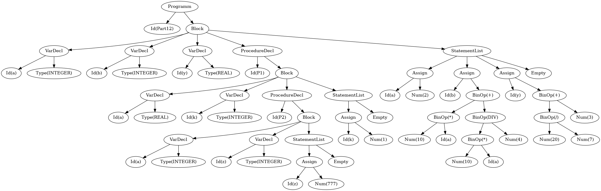

```pascal
PROGRAM Part12;
VAR
  a, b : INTEGER;
  y    : REAL;

  PROCEDURE P1;
  VAR
  
      a : REAL;
      k : INTEGER;
      PROCEDURE P2;
      VAR
        a, z : INTEGER;
      BEGIN {P2}
        z := 777;
      END;  {P2}
  
  BEGIN {P1}
      k := 1;
  END;  {P1} 

BEGIN {Part12}
  a := 2;
  b := 10 * a + 10 * a DIV 4;
  y := 20 / 7 + 3.14;
END.  {Part12}
```

```
emiliano@DESKTOP-BOLNHDP:~/interpreter/chapter12$ c++ main.cpp
emiliano@DESKTOP-BOLNHDP:~/interpreter/chapter12$ ./a.out < test/test_ok.pas
Program(
  Id(Part12)
  Block(
    VarDecl(
      Id(a)
      Type(INTEGER)
    )
    VarDecl(
      Id(b)
      Type(INTEGER)
    )
    VarDecl(
      Id(y)
      Type(REAL)
    )
    ProcedureDecl(
      Id(P1)
      Block(
        VarDecl(
          Id(a)
          Type(REAL)
        )
        VarDecl(
          Id(k)
          Type(INTEGER)
        )
        ProcedureDecl(
          Id(P2)
          Block(
            VarDecl(
              Id(a)
              Type(INTEGER)
            )
            VarDecl(
              Id(z)
              Type(INTEGER)
            )
            StatementList(
              Assignment(
                Id(z)
                Num(777)
              )
            )
          )
        )
        StatementList(
          Assignment(
            Id(k)
            Num(1)
          )
        )
      )
    )
    StatementList(
      Assignment(
        Id(a)
        Num(2)
      )
      Assignment(
        Id(b)
        BinOp[+](
          BinOp[*](
            Num(10)
            Id(a)
          )
          BinOp[DIV](
            BinOp[*](
              Num(10)
              Id(a)
            )
            Num(4)
          )
        )
      )
      Assignment(
        Id(y)
        BinOp[+](
          BinOp[/](
            Num(20)
            Num(7)
          )
          Num(3)
        )
      )
    )
  )
)

--- Symbols Table ---
INTEGER - <INTEGER>
REAL - <REAL>
a - <a:<INTEGER>>
b - <b:<INTEGER>>
y - <y:<REAL>>
---------------------
{a => 2,b => 25,y => 5.85714}

--- Symbols Table ---
INTEGER - <INTEGER>
REAL - <REAL>
a - <a:<INTEGER>>
b - <b:<INTEGER>>
y - <y:<REAL>>
---------------------
{a => 2,b => 25,y => 5.85714}

emiliano@DESKTOP-BOLNHDP:~/interpreter/chapter12$ dot -Tpng ast.gv -o ast.png
```

